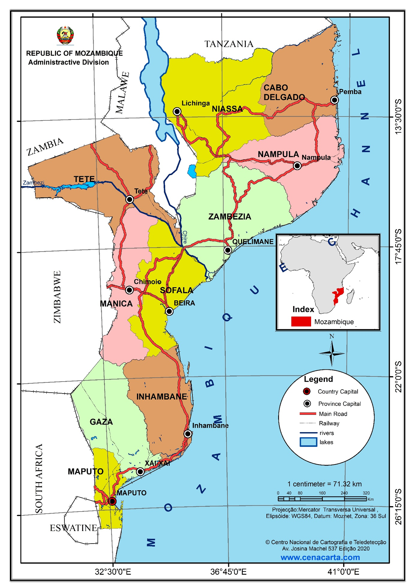
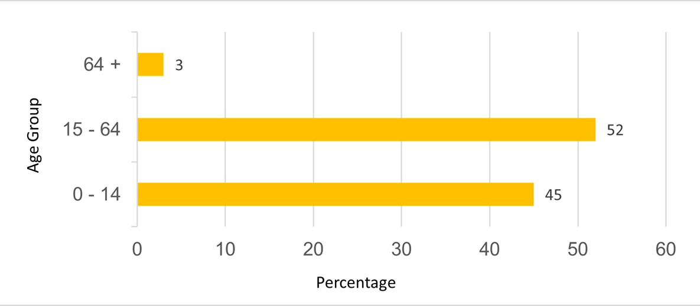
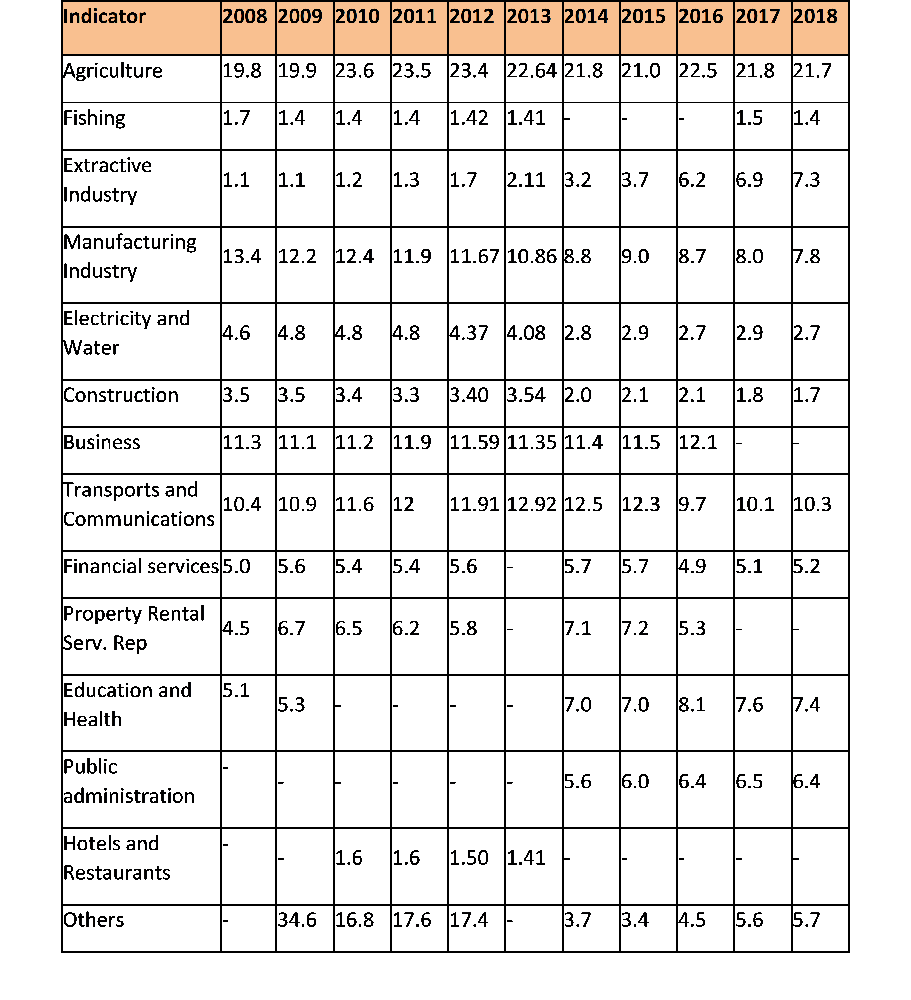

# NATIONAL CIRCUMSTANCES

## Geography 

___(From Second National Communication Draft)___

The Republic of Mozambique is situated in the southern hemisphere, on the south-eastern coast of the African continent, between latitudes 10º27'S and 26º52'S and meridians 30º12'E and 40º51'E. The country has an area of 801,590 km2 of dry land and about 13,000 km² of inland water. The eastern part of the country is bathed by the Indian Ocean, with a coastline of approximately 2,700 km. In its northern part, it is bordered by Tanzania; to the northwest by Zambia, Malawi and Lake Niassa; Zimbabwe, to the west; South Africa, to the southeast; and to the south, by E-Swatini (then Swaziland), on a terrestrial international boundary line approximately 4,330 km long. To the east, the country is bounded by the Indian Ocean and separated from Madagascar by the Mozambique Channel (Figure 1.1).

Administratively, the country is divided into 10 provinces. However, the municipality of Maputo city (the country's capital) has the status of a province, bringing the number to 11. The provinces are currently divided into 154 districts (26 more districts from the previous 128) which, in turn, are divided into 419 local administrative districts, called administrative posts. The latter are made up of 1,052 Localities, the lowest level of administrative configuration in the Mozambican State. To the subdivisions reported above are added 53 municipal authorities, of which 33 were created in 1998, another 10 in 2008 and another 10 in 2013.

There are numerous islands along the 2,700 km of coastline, including the Quirimbas archipelago in Cabo Delgado province, Ilha de Moçambique and the Goa and Sena islands in Nampula province, the Bazaruto archipelago in Inhambane, and the Inhaca, Portugueses and Xefina islands in Maputo province. 

_Figure 1.1: Map of Mozambique with international boundaries_

{width=90%}

_Figure 1.2: Map of geographical location of Mozambique with appropriate administrative division by provinces._

{width=85%}

___(From General Outline Prototype NAP)___

Mozambique is situated on the Eastern coast of Southern Africa, between 10º27´S and 26º52´S latitudes and 30º12´E and 40º51´E longitudes. The total land area is 784,090 Km². The country is divided into 11 provinces including Maputo city, which is also considered a province. About 70% of the coutry is covered by savanna and secondary forests. Approximately 45% of the territory has potential fos agriculture.

About 60% of the land is classified as managed land, including agriculture and permanent pasture lands. The shelf area up to 200m depth and 104 Km² and the total area of the Exclusive Economic Zone is 562 Km².

The climate in the Northern region of the Zambezi River is under the influence of the equatorial low – pressure zone with a NE monsoon in the warm season. The climate in the Southern area of Zambezi River is influenced by subtropical anti-cyclonic zone. In the North of Sofala, along the Zambezi River, lays a transitional zone with high rainfall figures.

In the North of Mozambique, the winds are influenced by the monsoon system with NE winds during the southern summer and SWwinds during the southern winter. Central and Southern Mpzambique are dominated by the SE trade winds.

The average annual precipitation is about 1200 mm. The rainfall is mainly restricted to the warm season, November to April. According to the classification of Köppen, the Norther areas ( Cabo Delgado, Niassa, Nampula and Zambezia) and the coastal region climate is classified as tropical rain savanna, whereas the climate of the upland areas of the interior is humid and temperate. Ocean currents, particularly the Mozambique warm current, may influence the rainfall.

Mozambique has more than 100 rivers. The major ones are: Rovuma, Lurio and Zambezi in North, Pungue, Buzi, Gorongosa and Save in the center and Limpopo, Incomati and Maputo in the South. These rivers drain about 208 Km3 of water rich in nutrients into the coastal waters. About 80% of this water enters the ocean from Sofala Bank, central Mozambique. Zambezi River, the largest river in Eastern Africa, alone, contributes with 67% of the total river discharge in the whole country.

The tidal rangr is about 2m in the South, 3.1m in the North and about 6.4m in the Center. High range in the center is throught to be related to both the shallowness and channel effects. The tidal wave entering the Mozambique Channel through the South would, due to Coriolis, induce an increment in the Mozambican coast.

In terms of administrative divisions and, in accordance with Mozambican Constitution, Mozambique is divided into eleven provinces, which are sub-diveded into 154 districts, Administrative Post and urban centres, which have also a special politicao-administrative status. 

_Source: Initial Communication 2003_

## Relief

___(From Second National Communication Draft)___

The relief of the country is arranged in the form of an amphitheater, with a mountainous area in the west, which descends in flattened steps to the coastal plain in the east. Thus, according to altitude, plains, plateaus, mountains and depressions are identified in Mozambique. The coastal plain, with altitudes of up to 200 meters, extends along the entire coastal strip, narrowing from the mouth of the Rovuma river to the Zambeze delta and extending southwards to the so-called great Mozambican plain, up to Ponta de Ouro. It occupies 1/3 of the national territory. There are also the so-called depression plains which extend along the valleys of the main rivers, eventually receiving the name of the respective hydrographic basins, for example: Incomati Plain, Limpopo Plain, Save Plain, Búzi Plain, Lúrio Plain, Lugela Plain, Messalo Plain and Zambezi Plain.

In the plateau area, the following are distinguished:

* Medium plateaus (200m – 600 m altitude)
* High plateaus (600m – 1,000 m altitude).

The main plateaus are:

* __Mozambican Plateau__: located in the provinces of Zambézia and Nampula. In this region, the plateaus have altitudes ranging from 600 to 1,000 meters of altitude. The main characteristic of the Mozambican plateau is the occurrence of "inselbergs" called islands or residual mountains;
* __Niassa Plateau__ - located in Niassa province, along Lake Niassa;
* __Mueda Plateau__ – located in the province of Cabo Delgado;
* __Chimoio Plateau__ – located in Manica province, close to the border with Zimbabwe;
* __Maravia Plateau__ – located in the province of Tete, near the border with Zambia; and,
* __Angónia Plateau__ – located in Tete province, close to the border with Malawi.

Mountain formations with altitudes equal to or greater than 1,000 meters are located at:

* __Western Niassa__: where the mountainous elevations have an Ipsilon (Y) shape, forming a chain or Maniamba-Amaramba system in which stand out mountains such as: Jéci (1,836 m), Mitucuè (1,803 m), Sanga (1.79 m), Chitagalo (1,803 m), Chissindo (1,579 m) and Txingeia (1,787 m);
* __Northwest of Zambézia and Tete__: in Zambézia there are the Chire-Namúli formations with hills such as: Namúli (2.419 m), Chiperone (2.054 m), Inago (1.807 m), Mabu (1.646 m), Tumbine (1.542 m) , Derre (1.417 m) and Mongue (1.043 m); and, in Tete, the hills (Plateaus of Maravia-Angónia) are in its northern part near the border with neighboring Malawi, the highlight goes to the hills: Domuè (2.096m) and Chiobuè (2.021 m);
* __West of Manica__: escarpment of the same name or massif of Chimanimani near the border with Zimbabwe, it is in this massif where the highest mountain of the country is located, the Binga (2,436 m of altitude, in the district of Sussundenga), (35 km) of length and a width that varies of (8 to 10 km) and distances of the city of Chimoio in about 80 km, Serra Choa (1,844 m). Still in this province, the Espungabera massif is located with an altitude of approximately 1,000m, separating Chimanimani from the Gorongosa Mountains (Sofala) with a maximum altitude of 1,863m.

In the southern region of the country there are no mountain formations, per se, due to its altitude. However, we fall into an illusion when we look at the plateau chain of the Libombos, as it is located in a predominantly flat region because, in fact, it is nothing more than a highland plateau with only 802 m altitude (Mount M'ponduíne) in Namaacha, near the border with E-Swatini and South Africa.

## Population

___(From Second National Communication Draft)___

The Mozambican population is 27,909,798 inhabitants (INE 2017), with about 52% women and 48% men. The distribution by age group is about 45% for 0-14 years, 52% for 15-64 years and 3% for over 64 years (figure 1.3). The most widely spoken national languages in the country include KiSwahili, EMakhuwa, CiSena, XiNdau, XiTsonga, XiTchope, Guitonga, CiNyungwe, EChwabo, EKoti, ELomwe, CiNyanja, CiYao, XiMakonde and KiMwane, out of more than 40 languages in the country. The language adopted as official is Portuguese, inherited from the colonizing country, Portugal, from which Mozambique became independent on June 25, 1975.

Mozambique has registered significant population growth with an average annual rate of 2.4% over the last ten years. Between 2007 and 2017 there was a growth of 8.4 million inhabitants, against 4.4 million between 1997 and 2007 (figure 1.3). According to projections, the Mozambican population may exceed 50 million inhabitants by 2050. These data show how the demographic issue will play a very important role in the planning of the country's socioeconomic development and the potential challenges for the management of natural resources that is the main source for the majority of the population, as well as the environment.

_Figure 1.3: Population age structure (INE, 2017 census)_

{width=90%}

_Source:_ http://www.ine.gov.mz/estatisticas/estatisticas-demograficas-e-indicadores-sociais/populacao

Other demographic indicators are shown in Table 1.1. This table highlights the reduction in the maternal and infant mortality rate, as well as the increase in life expectancy. The illiteracy rate has also decreased, although it is still high, particularly among women.

_Table 1.1: Evolution of demographic indicators in Mozambique between 1980 - 2017_

## Economy 

___(From Second National Communication Draft)___

Agriculture in Mozambique is the pillar of the national economy. The sector employs 90% of the female labour force and 70% of the male labour force, that is, 80% of the Mozambican active population works in the agricultural sector (PEDSA, 2011). Agriculture has an average share in GDP above 20% of the total. The trade and transport and communications services sectors contributed an average of 10% each (Table 1.3). The extractive industry sector has shown great performance in recent years, rising from 2% in 2013 to just over 7% in 2018 (INE: National Accounts of Mozambique). The national economy has considerable potential in the primary sector, driven by the existence of natural resources, but the main challenge is the development of industries that allow for the sustainable exploration and transformation of these resources. Diversification of the national economy is still a challenge for more stable, comprehensive and sustainable growth. The Mozambican economy, after several years of growth of about 7% per year, has slowed since 2016, due to various factors of international and national conjuncture (table 1.2).

_Table 1.2: Evolution of Economic Indicators, 2008-2018_

_Table 1.3: Contribution of sectors to GDP_

_Source: INE: National Accounts of Mozambique_

## Social Context

___(from National Developement Strategy 2015-2035)___

The human development indicators, namely the Human Development Index (HDI) and the Gender-Adjusted Human Development Index (GDI) registered a positive trend that results basically from the positive results achieved in economic growth, access to school, longevity and reduction of gender inequality in access to income.

_Table 1.1 - Human Development Indicators, 2009-2012_

{width=60%}

_Source: INE and UNDP_ 

Despite the country's positive performance, the challenges of combating poverty still persist. The human development situation remains critical, as almost 10 million Mozambicans live in poverty, with problems of food insecurity, low income and unemployment.

_Table 1.1. Social Indicators_

{width=70%}

_Source: IOF, 2008/09_

The population's poverty rate fell from 69.4% in 1997 to 54.7% in 2008, but the poverty situation stagnated from 2003 to 2008. In this context, the government has been accelerating measures aimed at reducing poverty levels by adopting policies and actions leading to the development of human capital, namely the improvement of basic social services and an increase in entrepreneurial initiatives that contribute to increased production, employment generation and income for Mozambicans, particularly young people and women.

___(from National Strategy for Basic Social Security 2016-2024)___

__Vulnerability and shocks at the household level__

The situation of the household influences the vulnerability of each of its members. About half of the population (54.7%) lives below the poverty line and a significant part that has an income above the poverty line is very vulnerable to the risk of falling into poverty in case of shocks.

On the other hand, as mentioned in the 2014/15 Household Budget Survey Report, “the level of expenditure from the first to the fourth quintile shows moderate differences”. There are few differences in the levels of ownership of assets, income and consumption among households located in the poorest deciles of the population.

Given this situation, two thirds of the population have a level of consumption below the poverty line. The remainder, with incomes relatively above the poverty line, are at risk of falling below the poverty line in the event of small shocks or slight variations in income levels. Although there is a group of households with slightly higher living standards, this corresponds to approximately 20% of households in rural areas and 40% in urban areas. 

Poverty accentuates most social risks, including child mortality, chronic malnutrition, school dropout, child labor, early marriages, among others.

Food insecurity is a challenge in Mozambique and it is more accentuated in the arid and semi-arid areas during the periods from November to March. In rural areas, poverty and food insecurity are caused by low agricultural productivity (rainfed agriculture, low levels of fertiliser use, weak links to markets, etc.).

There is a geographical dimension to vulnerability in Mozambique, with the most disadvantaged groups generally being households living in the areas most distant from markets and services, mainly in rural areas.

In some regions, households are vulnerable to natural disasters, including drought, floods and cyclones. These reduce the level of consumption of the affected populations and deteriorate their goods and assets, accentuating their vulnerability. Households are also vulnerable to unusual or individual shocks that affect a single household, such as serious illness or the death of a productive family member.
