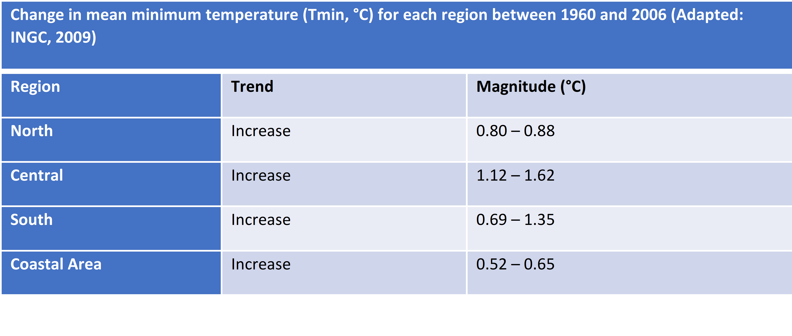

# CURRENT AND FUTURE CLIMATE

## Current Climate

___(from Second National Communication Draft)___

According to the Köppen-Geiger classification, the climate of Mozambique is generally of the Aw type (humid and dry tropical) and with pockets of BSh (hot semi-arid climate), with two very distinct seasons, one hot and rainy , from October to April, and the other cold and dry, from May to September (Gelcer et al. 2018). Other manifestations of climates of the As, Cfa and Cwa types can be found in isolation (figure 1.5).

_Figure 1.5: Mozambican climate according to the Köppen-Geiger classification. As = tropical rainy climate; Aw = wet and dry tropical climate; BSh = hot semi-arid climate; Cfa = warm and humid temperate climate; Cwa = warm temperate climate with dry winter._ 

{width=85%}

_Source: Gelcer et al. (2018)._

The atmospheric circulation in the country is characterized by zones of influence of low equatorial pressures with NE monsoon winds during the summer. The winds in the south and central zone are predominantly SE trades, and in the north zone they are influenced by a monsoon regime with NE winds during the summer and SW during the winter. Mozambique's precipitation regime is influenced by tropical cyclones formed in the southwestern Indian Ocean basin during the summer, the Intertropical Convergence Zone (ITCZ), the Indian Monsoon, the low pressure systems over the continent, Atlantic and Indian Anticyclones, El Niño/Southern Oscillation (ENOS) and Cold Fronts (Macie, 2016).

The spatial distribution of precipitation varies widely across the country. Precipitation is most abundant in the northern zone, where the annual average varies between 800 and 1,200 mm, becoming exceptionally high, 1,500 mm, in the highlands of Zambezia, Niassa and mountainous areas of Gorongosa. Central Mozambique and the entire coastline receive amounts of rain ranging between 800 and 1,000 mm. However, in some regions of the province of Tete, precipitation values can decrease by up to 600 mm. The south of the country is generally drier, with an average rainfall of less than 800 mm, reaching values of 300 mm at the administrative post of Pafuri, in Gaza province (figure 1.6).

_Figure 1.6: Spatial distribution of accumulated annual precipitation in Mozambique_


_Source: Mozambique Precipitation Atlas, INAM, 2012_

___Seasonal Precipitation Variation___

The period of greatest rainfall in the country corresponds to the summer in the Southern Hemisphere, between October and April. During the rainy season, the highest precipitation values occur in the months of January, February and March (figure 1.7), contributing to about 45% of the total annual precipitation and is often associated with the migration and activity of the Inter-Tropical Convergence Zone (ITCZ).

In the northern region of the country, typical monthly precipitation values are 20 – 200 mm/month during the rainy season and 5 – 30 mm/month in the dry season. The central region registers between 30 – 200 mm/month in the rainy season and 20 – 40 mm/month in the dry season. Southern Mozambique, with the lowest precipitation values, registers between 40 -130 mm/month in the rainy season and 20 - 40 mm/month in the dry season. It is mainly the southern region that is prone to drought and some southern parts of Tete province in the center of the country.

_Figure 1.7: Seasonal variation in monthly rainfall accumulated in different regions of the country_ 


_Source: INGC, 2009_ 

___Interannual variation of precipitation___

In Mozambique there is very high inter-annual rainfall variability in the rainy season, particularly in the central and southern regions. This variability causes significant fluctuations in the annual amounts of precipitation, with years with an abundance of precipitation (with greater probability of floods or inundation) or precipitation deficit (with greater probability of droughts) being registered. Figure 1.8 shows rainfall deviations from the climatological mean in four geographic regions of the country including the coastal region, from 1960 to 2006. The best-documented cause of this variability is the southern oscillation and the El Niño phenomenon (ENSO), which causes on average warmer and drier conditions; and relatively cooler and wetter conditions (La Niña) in the rainy season of eastern southern Africa. Evidence on the relationship between ENSO and rainfall in southern Africa can be found in several studies (Reason et al., 2000; Reason and Jagadheesha, 2005).

_Figure 1.8: Precipitation deviations showing intra-annual variability and probability of occurrence of floods and droughts in four regions of the country, north, centre, south and coastal_ 


_Source: INGC, 2009._

__Average Temperatures__

In general, average temperatures in Mozambique range between 25 – 30 °C (average maximum temperatures) and between 15 – 21 °C (average minimum temperatures) (figure 1.9). The highest mean maximum temperatures are recorded in the coastal area of the country, in the south of Tete province and in the western part of Gaza province (figure 1.9 on the left). As for the average minimum temperatures, these have a decreasing pattern from the coast to the interior. The highest average minimum temperatures are recorded along the northern coast, while the lowest are found in Gaza province (WFP, 2018). In this region of Gaza, there is also the largest temperature range in the country.

_Figure 1.9: Spatial distribution of mean maximum temperature (left) and mean minimum temperature in Mozambique, calculated for the period 1982 - 2017._


_Source: WFP, 2018. Mozambique Climate Analysis._

## Historical Trends

___(from Second National Communication Draft)___

Average temperature trends show positive variations (increase in average temperature) in most parts of the country. Studies indicate that the average annual temperature increased by 0.6 °C between 1960 – 2006, at an average rate of 0.13 °C per decade for most seasons of the year (INGC, 2009). The study also points to an increase in the frequency of hot days and nights (days with a maximum temperature> 30 °C and nights with a minimum temperature> 20 °C respectively). The average number of "hot" days per year in Mozambique increased by 6.8% of days (~25 days) and the average number of "hot" nights per year increased by 8.4% of nights (~31 nights) during the same period in analysis (1960 and 2006).

_Maximum and minimum temperatures_

Trends in increasing maximum and minimum temperatures (warming) have not been uniform across the country. Increases in mean maximum temperature of greater magnitude were recorded in the North (0.76 – 1.16 °C), followed by central Mozambique between 1960 and 2006. Changes in average minimum temperatures in certain regions of the country are even greater, indicating large increases between 1.12 - 1.62°C (in the central region of the country) during the same period under analysis (INGC, 2009). Tables 1.4 and 1.5 provide a summary of trends in average maximum and minimum temperatures for different regions of the country.

_Table 1.4: Change in mean maximum temperature (Tmax, °C) for each region between 1960 and 2006_ 


_Adapted: INGC, 2009_

***

_Table 1.5: Change in mean minimum temperature (Tmin, °C) for each region between 1960 and 2006_ 



_Adapted: INGC, 2009_

***

_Precipitation Trends_

Precipitation trends in the country are not significantly observable, due to the great inter-annual variability of rainfall in different seasons. However, the analysis of historical data made in several studies points to a late start of the rainy season in Mozambique, as well as an increase in the persistence of dry days.

The INGC report (2009), analysing data between 1960 and 2006, indicates a delay in the start of the rainy season that can reach between 20 and 45 days in some places, as well as a more pronounced persistence of dry days in the Northeast of the country from March to May and September to November.

The study by Mcsweeney et al. (2010) found that in the period between 1960 and 2006, the average annual rainfall in Mozambique decreased at an average rate of 3.1% per decade, in the period under review. On the other hand, despite the decreases observed in total rainfall, the amount of rain falling during heavy rain events increased at an average rate of 2.6% per decade, with these increases being more pronounced in the period from December to February (DJF ).

_Climate Projections_

* Future Temperature Projections

The Intergovernmental Panel on Climate Change (IPCC) in its Fifth Assessment Report (AR5) presents unequivocal evidence of climate change around the world: the atmosphere and oceans are warming, the extent and volume of snow and ice is decreasing, sea levels are rising and weather patterns are changing. The most optimistic scenario predicts an increase in the Earth's temperature between 0.3 °C and 1.7 °C and, in the worst case scenario, the Earth's surface could warm between 2.6 °C and 4.8 °C over this century by 2100 (IPCC, 2014) . The Paris Agreement approved in December 2015 under the United Nations Framework Convention on Climate Change (UNFCCC) established a global framework to reduce carbon dioxide (CO2) emissions and noted that global warming should be limited to 1.5°C.
In Mozambique, some studies point to a significant increase in temperature, with the average annual temperature projected to increase between 1.0 to 2.8 °C by 2060 and between 1.4 to 4.6 °C by 2090 (INGC, 2009; Mcsweeney et al. al., 2010) (figure 1.10). The projected rate of warming will be faster in inland Mozambique than in areas closer to the coast. All projections indicate substantial increases in the frequency of days and nights considered "hot" in the current climate. This increase will be between 17 and 35% of days per year around 2060, and between 20 and 53% of days per year in 2090. The same projections also indicate a reduction in the frequency of days and nights considered "cold" in the current climate.

_Figure 1.10: Average annual temperature trends in Mozambique between 1960 and 2006 (black line) and the projected future for three emission scenarios (colored lines). The colored bars on the right side indicate the different scenarios used in the simulations (A2, A1B and B1) as well as the uncertainty ranges in the average climate projections around 2090 – 2100_ 


_Adapted from Mcsweeney et al., 2010._

_Future Precipitation Projections_

Precipitation variations are not as clear as temperature variations. The range of precipitation projections resulting from different models is large and encompasses both negative and positive changes. There are indications of variations between -15 to +20 mm per month, or -15% to +34% (Mcsweeney et al., 2010). However, the models show more consistency in seasonal projections, indicating a reduction in rainfall in the dry season, that is, in the period from June to August (JJA) and from September to November (SON). This reduction is partially offset by increased rainfall in the rainy season, from December to February (DJF), with greater expression in northern Mozambique (Mcsweeney et al., 2010). In general, precipitation projections do not indicate substantial changes in annual precipitation, but rather changes in precipitation patterns (Figure 1.11).

_Figure 1.11: Spatial patterns of monthly rainfall averages from September to November projected for the years 2030, 2060, and 2090_ 


_Adapted from Mcsweeney et al., 2010._

##  Baseline climate based on 1981-2010

### National

```{r, include=FALSE, message=FALSE, echo=FALSE, warning=FALSE}
#install.packages("rnaturalearth")
library(raster)
library(rasterVis)
library(reshape)
library(dplyr)
library(lubridate)
library(tidyr)
library(magrittr)
library(R.utils)
library(sf)
library(plotly)
library(ggplot2)
library(sp)

```

```{r, cache=TRUE, warning=FALSE, message=FALSE, echo=FALSE, warning=FALSE}
#preurl<- "https://crudata.uea.ac.uk/cru/data/hrg/cru_ts_4.05/cruts.2103051243.v4.05/pre/cru_ts4.05.1901.2020.pre.dat.nc.gz"
#download.file(preurl, destfile="cru_ts4.05.1901.2020.pre.dat.nc.gz")
#gunzip("cru_ts4.05.1901.2020.pre.dat.nc.gz")

#tmpurl<- "https://crudata.uea.ac.uk/cru/data/hrg/cru_ts_4.05/cruts.2103051243.v4.05/tmp/cru_ts4.05.1901.2020.tmp.dat.nc.gz"
#download.file(tmpurl, destfile="cru_ts4.05.1901.2020.tmp.dat.nc.gz")
#gunzip("cru_ts4.05.1901.2020.tmp.dat.nc.gz")

```

```{r, warning=FALSE, message=FALSE, echo=FALSE, warning=FALSE}
library(rnaturalearth)
mozambique<-rnaturalearth::ne_countries(country ='mozambique')
```


```{r, message=FALSE, echo=FALSE, warning=FALSE}
prstack<-stack("C:\\Users\\marti\\Documents\\GitHub\\camila_mozambique_NAP_draft\\cru_ts4.05.1901.2020.pre.dat.nc")
temp<-stack("C:\\Users\\marti\\Documents\\GitHub\\camila_mozambique_NAP_draft\\cru_ts4.05.1901.2020.tmp.dat.nc")

pr_crop<-raster::crop(prstack, mozambique) 
pr_mask<-raster::mask(pr_crop, mozambique)

tcrop<-raster::crop(temp, mozambique)
tmask<-raster::mask(tcrop, mozambique)

```


```{r, warning=FALSE, message=FALSE, echo=FALSE, warning=FALSE}
prdf<-as.data.frame(pr_mask, xy=TRUE, na.rm=TRUE)%>% 
  melt(id.vars=c('x','y'))
tmpdf<-as.data.frame(tmask, xy=TRUE, na.rm=TRUE)%>%melt(id.vars=c('x', 'y'))

Date<-substr(prdf$variable, 2,11)
prdf$Date<-Date 
Year<-substr(Date,1,4)
Month<-substr(Date,6,7)
prdf<-cbind(prdf, Year, Month)

colnames(prdf)[colnames(prdf)=="value"]<-"pr"

tmpdf$Date<-substr(tmpdf$variable, 2,11) 
tmpdf$Year<-substr(tmpdf$Date,1,4)
tmpdf$Month<-substr(tmpdf$Date,6,7)
#prdf<-cbind(prdf, Year, Month)

colnames(tmpdf)[colnames(tmpdf)=="value"]<-"tmean" 
```


```{r, warning=FALSE, message=FALSE, echo=FALSE, warning=FALSE}

pr_monthly<-prdf%>%dplyr::filter(Year>=1981)%>% group_by(Month)%>%
  summarise(across(contains("pr"), ~mean(pr)))

pr_monthly$Month<-factor(pr_monthly$Month,levels = c('07','08','09','10','11','12','01','02','03','04','05','06'))

temp_monthly<-tmpdf%>%dplyr::filter(Year>=1981)%>%group_by(Month)%>%summarise('tmean'=mean(tmean))
temp_monthly$Month<-factor(temp_monthly$Month, levels = c('07','08','09','10','11','12','01','02','03','04','05','06'))

pr_tmp<-cbind(pr_monthly,temp_monthly) 
pr_tmp<-pr_tmp[,-3]

ty<-list(overlaying = "y",
  side = "right",
  title = "Temperature (°C)",
  autotick = FALSE,
      dtick = 10,
 range=c(0,30)
  )

plotly::plot_ly(type= 'bar', data= pr_tmp, x= ~Month, y= ~pr, name = 'Precipitation')%>%
  plotly::add_lines(x= ~Month, y= ~tmean, mode = 'lines+markers',name= 'Temperature', yaxis='y2')%>%

    plotly::layout(legend=list(orientation='h', y=-0.18,x=0.3), yaxis=list(title='Precipitation (mm)',showticklables=F, range=c(0,600)),width=600, height=500, title='Mozambique \n (Mean 1981-2020)', yaxis2=ty)

```

