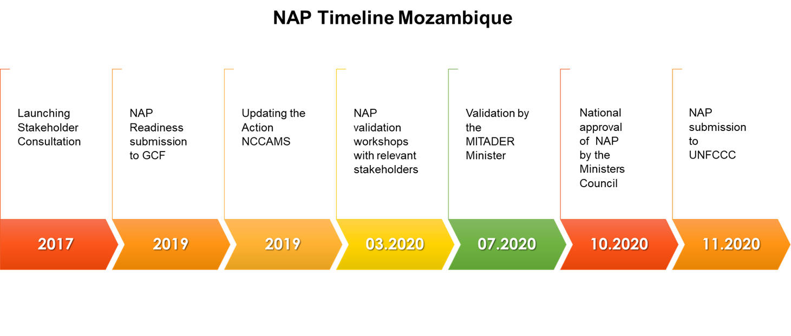

# NAP Info

## Framework for the NAP

### Essential functions of the NAP process

### The NAP as the umbrella programme for adaptation

### Coherence with national development context, SDGs, Sendai and other relevant frameworks

## NAP Approach

### Guiding principles

### A systems approach to adaptation

___(From General Outline Prototype NAP)___

The Government of Mozambique identifies climate shocks and seasonal variability, over exploitation of marine and timber resources, solid waste management, environmental sanitation and uncontrolled bush fires as major challenges.

_Key economic sectors and systems_

### Road Map

___(From General Outline Prototype NAP)___

## Vision, goals and objectives

