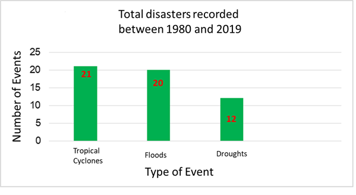
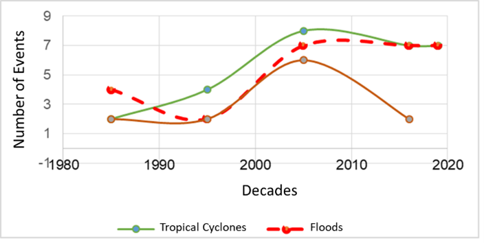
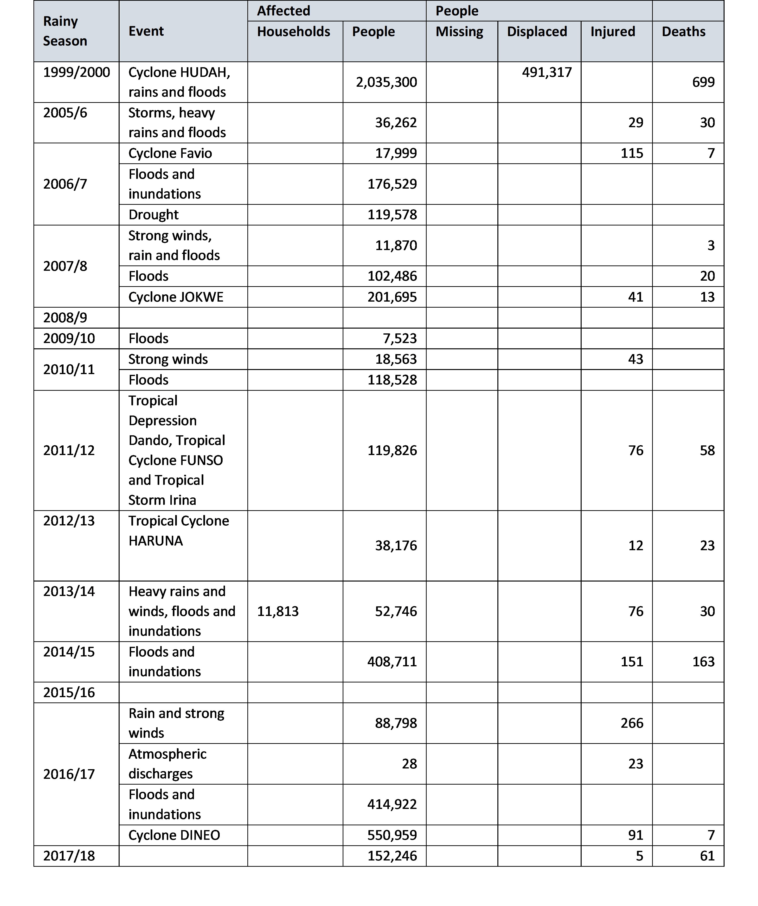

# Vulnerabilities and Impacts Assessment

## Vulnerabilities, impacts and risks

___(From Second National Communication Draft)___

__Introduction__

Mozambique is vulnerable to climate change due to its geographic location, low adaptive capacity as a result of poverty, limited investments in technology and weak infrastructure and social services. Climate change manifests through increased frequency and intensity of extreme events (droughts, floods, floods, event storms and tropical cyclones), rising sea levels, changes in temperature and precipitation patterns.

The consequences of the impacts of climate change include loss of human life, destruction of social and economic infrastructure, loss of domestic animals, loss of agricultural areas and crops, increased prices of agricultural products, deterioration of human health, environmental degradation with emphasis on erosion and saline intrusion.

This chapter presents the results of the vulnerability assessment and adaptation measures carried out in 2010, which covered the following sectors/areas: agriculture (maize cultivation in Chokwé); pastures and livestock, in the Limpopo basin; water resources, the Maputo basin was considered; fishing, shrimp in the Sofala bank; the coastal zone; mopane forests; and, health considered malaria and cholera. In the process of updating the SNA that started in 2020, other relevant sectors/areas were included, namely, biodiversity, infrastructure, energy and social protection, for which a review of the existing literature was carried out. Information on the impact of extreme events that occurred in the country in the sectors/areas covered was also included, using the Balance Sheet Reports of the Rainy Seasons produced by INGD.

Information on the vulnerability of the health sector was updated based on the preliminary results of the study “Assessment of the Vulnerability and Adaptation to Climate Change of the Health Sector in Mozambique” which includes the assessment of the impact of climate change on two climate-sensitive diseases in Mozambique: Malaria and Acute Diarrhea, carried out by MISAU.

In addition to the vulnerability assessment mentioned above, this chapter includes summary information on the vulnerability of 98 districts (Table 3.2) in which Local Adaptation Plans (PLAs) were formulated and approved within the scope of the implementation of ENAMMC. For the formulation of the PLAs in the districts, at least two communities in the district that participate in the assessment of the climate vulnerability and adaptability of the communities are involved – Step 2 of the guide for the Formulation of Local Adaptation Plans. After the assessment with the communities, step 3 is followed, which is an assessment in the district. These two steps aim to determine the extent to which communities/districts are vulnerable to climate change, analysing trends, threats, opportunities and adaptive capacity of communities/districts to climate change and determining adaptation measures to improve their resilience to climate change.

The Guide for Formulating Local Adaptation Plans includes the Climate Vulnerability and Capabilities Analysis (CVCA) tools - developed by CARE and the Theory of Change (ToM). The PLAs are part of the short-term objectives defined by ENAMMC - increasing local resilience, fighting poverty and identifying opportunities for adaptation and low-carbon development at the community level, to be included in district planning.

__Climate Change Impacts__

___Disasters___

Historical data on extreme events show that three climate-related hazards are most likely to occur in Mozambique, namely tropical cyclones, floods and droughts. These events are often associated with socio-economic damage, translated into loss of human life, human suffering, loss of assets, destruction of critical infrastructure (eg health facilities, schools, access roads, etc.) and other indirect losses.

An analysis of data from 1980 to 2019 shows that Mozambique was affected by 21 tropical cyclones, 20 flood events and 12 droughts (figure 3.1). This means that on average, the country is affected by a tropical cyclone or a flood event every two years and a drought event every three years. Tropical cyclones and flood events represent about 77% of the total events that occurred in the period under review.

_Figure 3.1: Total number of extreme events that occurred in Mozambique between 1980 – 2019 _

_Source: produced based on DeSinventar data and INGC rainy season balance reports._

___Historical trends of extreme events___

One of the crucial questions today is whether there is any evidence of an increase in extreme disaster-causing events or not. Through an analysis of the trend of events registered in the last four decades (1980 – 2019), it is noted that the number of events that devastated the country increased significantly since the 2000s (figure 3.2). From the decade (2000-2010) to the current, the number of cyclones competes with the number of flood events, despite the slowdown of drought events.

Taking into account that tropical cyclones are often associated with heavy rain events that can contribute a significant proportion of precipitation in a very short period which in turn cause flooding in various regions of the country, with serious implications for the health of communities, the worsening of these phenomena in recent decades should deserve special attention from health authorities and beyond.

_Figure 3.2: Trend in the number of extreme events occurring between 1980 and 2019._

The direct impact of these events is often expressed by the number of human lives lost, people affected through loss of personal property and livelihoods, destruction of the country's critical infrastructure such as roads, bridges, water supply system, schools, hospitals, as well as the outbreak of water-borne diseases (e.g. malaria, cholera, diarrhoea, etc.). However, the lack of systematic and homogeneous recording of events and their impacts and, on the one hand, the persistence in considering only large-scale and high-impact disasters over a short period of time have hidden thousands of small and medium-scale disasters that occur every year in the country. Consequently, Mozambique does not know the real value of direct and/or indirect economic losses associated with these events.

Table 3.1 presents the impact of climate change on the human dimension. Regarding the economic impacts, these are presented in the respective sectors where the vulnerability analysis is carried out.

_Table 3.1: Summary of impacts of extreme events on the human dimension_

_Source: Rainy Season Balance Reports 2000, 2005/6 to 2017/18_

The extreme weather events that occurred in Mozambique in 2000 and in the rainy seasons from 2005/6 to 2017/18 affected an estimated 4,074,606 people, injured 885 people and caused 1,114 deaths. About 50% of affected, injured and deaths resulted from the occurrence of Cyclone HUDAH, and it should be noted that tropical cyclones are events that cause greater impacts on the human dimension.

These impacts represent a setback in the process of poverty reduction, which is the priority of the Governments of developing countries, and increase their dependence on international aid. In this context, assessing the vulnerability of the most important social and economic sectors and identifying adaptation measures is of high priority.

_Table 3.2: PLAs prepared in the period 2014 to 2018_

The main threats indicated by communities and districts are grouped into droughts, floods and inundations, tropical cyclones/strong winds, sea level rise, epidemics, heat waves and/or cold spells, food insecurity, wildlife conflict and pests. (Include graph showing how each of the threats)

In addition to the PLAs, sector plans and other relevant instruments were also formulated, highlighting:

* The national action plan for the expansion of climate-resilient agriculture. This plan seeks to strengthen agricultural extension services to small farmers as well as knowledge management and sharing and strengthening in coordination with research and extension services;

* Ministerial approval of national climate-resilient road standards and maintenance approaches; and the ministerial approval of mandatory climate risk screening for new road investments;

* National Program for Productive Social Action (PNASP) through which households living in vulnerable districts are involved in public works activities in order to diversify their sources of income and, consequently, make them resilient.

___Climate Scenarios___

The vulnerability analysis carried out at the SNC considered the climate projections developed by INGC “Studies on the Impacts of Climate Change on Disaster Risk in Mozambique Synthesis Report – Second Version” in 2009.

The methodology of the INGC study was based on climatological modeling (temperature and rainfall) with the main purpose of understanding how Mozambique's climate may already be changing and how it can be expected to change in the future. This study details the observed changes in the country's seasonal climate during the period 1960 to 2005, in terms of temperatures and rainfall patterns (INGC, 2009).

Both historical trends and future projections were derived from daily temperatures (maximum and minimum) and rainfall values recorded since 1960, from 32 synoptic weather stations within Mozambique (INGC, 2009).

To project future scenarios in terms of the country's climate (temperature and rainfall), focusing on the mid-century (2046-2065) and late-century (2080-2100) periods, seven general circulation models were used: ECHAM, GFDL , IPSL, CCCMA, CNRM, CSIRO and GISS.

INGC's projections (2009) anticipate that climate change in Mozambique is mainly manifested in the following:

_Temperature  patterns_

* Atmosphere – with an average increase between 1.5ºC and 3.0ºC in the period between 2046 and 2065 and recording of more hot days and fewer cold days, with an increase in the maximum and minimum temperature;

* Oceans – with rising mean sea levels and changes in the distribution and availability of fish stocks and effects on marine ecosystems (such as corals);

_Precipitation patterns_

* With irregular rainfall behavior in terms of start and end times, rainfall (heavy precipitation phenomena in a short space of time) and duration of the rainy season (drought), disfiguring the notions of "official” and “real” start of the agricultural season, which may result in some regions in a decrease in current potential yields of around 25%;

* With a growing reduction in potential agricultural income levels of up to 20% in the main crops that constitute the basis of food security and an essential condition for improving the per capita income of Mozambican families;

_Increased frequency and intensity of extreme events (droughts, floods and tropical cyclones)_

* Persistence of the situation of extraordinary floods in identifiable places in the country which can be referred to as “risk zones”;

* Cyclones and other strong winds;

* Prolonged droughts;

_Sea level rise:_
15 cm, 30 cm and 45 cm as a consequence of thermal expansion and 15 cm, 110 cm and 415 cm as a consequence of the reduction of continental ice caps in the years 2030, 2060 and 2100, respectively;

* Areas with potential increased risk identified due to the emergence of other adverse natural phenomena such as loss by submersion and erosion of coastal areas, intrusion of saline water, desertification;

* Reduction of areas available for agricultural practice in green or low-lying areas;

* Many of the country's main coastal urban centers, including Maputo, Beira and Quelimane, are already in a critical situation in terms of vulnerability (human lives, properties, social infrastructure, etc.) to the effects of climate change.

***

___(General Outline Prototype NAP)___

Climate change impacts: highlights of recent impacts:

* Mozambique is particularly vulnerable to Climate Change (CC) due to its location  downstream of shared watersheds (Floods,  e.g. 2000 and 2013 Limpopo Basin; 2007 Zambeze, 2013 and 2019 Licungo Basin, etc.)

* Increase in the frequency and intensity of extreme climatic events, such as droughts, floods and tropical cyclones (recent cyclones with high impact: Idai and Keneth 2019, Eline in 2000, etc.)

* The long shoreline and the existence of extensive low-lands below sea level (sea level rise, storm surge, salt intrusion);. 

* The country’s vulnerability is also increased by its low adaptive capacity, poverty, limited investment in modern technology, and weaknesses in its infrastructure and social services, especially those related to health and sanitation (e.g. the malaria and cholera in 2019 after the cyclone Idai and Keneth in central and northern Mozambique). 

* These events result in the loss of human lives, crops, livestock and wildlife; the destruction of social and economic infrastructure; increased dependency on international support; food price increases; harm to human health and the environment; and the destruction of ecosystems. 

* CC represents a major barrier to the Government and its partners’ efforts to fight poverty and achieve the MDGs. 
(Government of Mozambique, 2012)

### Cyclones

### Drought

### Floods

## Climate Change Adaptation Assessment

